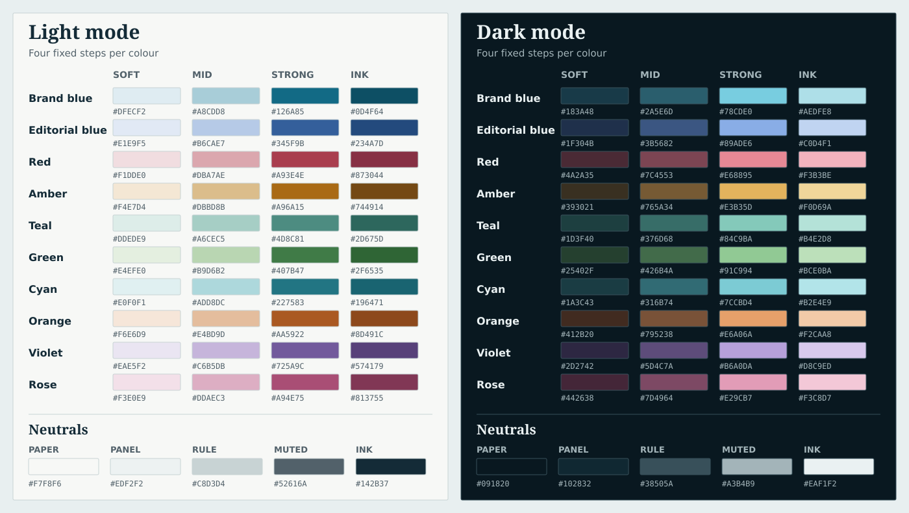

# Primary Signal design system

Primary Signal uses Harbour Blue in light and dark modes and the waveform P mark in its public identity.

This document is the reference for new public and administration UI. The two interfaces can use different page layouts, but share these foundations. Primary Signal should read as an editorial security publication: strong type, restrained colour, thin rules and clear source provenance. Colour supports labels and evidence; it never substitutes for them or implies a composite confidence score.

Administration story inspection uses the [Reading desk](admin-reading-desk.md) layout. The administration overview has no defined layout yet.

## Colour tokens

Use named, fixed steps. `soft` is a quiet surface, `mid` is for a hover border or selected surface, `strong` is the primary coloured cue, and `ink` is coloured text on a soft surface. The light and dark values are chosen separately; dark mode is not a numerical inversion of light mode. The selected brand blue is separate from the cooler editorial blue. A hue being available does not give it a product meaning; assign semantic aliases only when a component needs one.

| Hue step | Light | Dark |
| --- | --- | --- |
| `--ps-brand-blue-soft` | `#DFECF2` | `#183A48` |
| `--ps-brand-blue-mid` | `#A8CDD8` | `#2A5E6D` |
| `--ps-brand-blue-strong` | `#126A85` | `#78CDE0` |
| `--ps-brand-blue-ink` | `#0D4F64` | `#AEDFE8` |
| `--ps-blue-soft` | `#E1E9F5` | `#1F304B` |
| `--ps-blue-mid` | `#B6CAE7` | `#3B5682` |
| `--ps-blue-strong` | `#345F9B` | `#89ADE6` |
| `--ps-blue-ink` | `#234A7D` | `#C0D4F1` |
| `--ps-red-soft` | `#F1DDE0` | `#4A2A35` |
| `--ps-red-mid` | `#DBA7AE` | `#7C4553` |
| `--ps-red-strong` | `#A93E4E` | `#E68895` |
| `--ps-red-ink` | `#873044` | `#F3B3BE` |
| `--ps-amber-soft` | `#F4E7D4` | `#393021` |
| `--ps-amber-mid` | `#DBBD8B` | `#765A34` |
| `--ps-amber-strong` | `#A96A15` | `#E3B35D` |
| `--ps-amber-ink` | `#744914` | `#F0D69A` |
| `--ps-teal-soft` | `#DDEDE9` | `#1D3F40` |
| `--ps-teal-mid` | `#A6CEC5` | `#376D68` |
| `--ps-teal-strong` | `#4D8C81` | `#84C9BA` |
| `--ps-teal-ink` | `#2D675D` | `#B4E2D8` |
| `--ps-green-soft` | `#E4EFE0` | `#25402F` |
| `--ps-green-mid` | `#B9D6B2` | `#426B4A` |
| `--ps-green-strong` | `#407B47` | `#91C994` |
| `--ps-green-ink` | `#2F6535` | `#BCE0BA` |
| `--ps-cyan-soft` | `#E0F0F1` | `#1A3C43` |
| `--ps-cyan-mid` | `#ADD8DC` | `#316B74` |
| `--ps-cyan-strong` | `#227583` | `#7CCBD4` |
| `--ps-cyan-ink` | `#196471` | `#B2E4E9` |
| `--ps-orange-soft` | `#F6E6D9` | `#412B20` |
| `--ps-orange-mid` | `#E4BD9D` | `#795238` |
| `--ps-orange-strong` | `#AA5922` | `#E6A06A` |
| `--ps-orange-ink` | `#8D491C` | `#F2CAA8` |
| `--ps-violet-soft` | `#EAE5F2` | `#2D2742` |
| `--ps-violet-mid` | `#C6B5DB` | `#5D4C7A` |
| `--ps-violet-strong` | `#725A9C` | `#B6A0DA` |
| `--ps-violet-ink` | `#574179` | `#D8C9ED` |
| `--ps-rose-soft` | `#F3E0E9` | `#442638` |
| `--ps-rose-mid` | `#DDAEC3` | `#7D4964` |
| `--ps-rose-strong` | `#A94E75` | `#E29CB7` |
| `--ps-rose-ink` | `#813755` | `#F3C8D7` |

| Neutral role | Light | Dark |
| --- | --- | --- |
| `--ps-neutral-paper` | `#F7F8F6` | `#091820` |
| `--ps-neutral-panel` | `#EDF2F2` | `#102832` |
| `--ps-neutral-rule` | `#C8D3D4` | `#38505A` |
| `--ps-neutral-muted` | `#52616A` | `#A3B4B9` |
| `--ps-neutral-ink` | `#142B37` | `#EAF1F2` |

### Semantic aliases

Components use role aliases rather than choosing a hex value or hue step ad hoc. Text labels remain visible when a colour cue is present.

| Role | Token | Use |
| --- | --- | --- |
| Logo spectrum and wordmark | `--ps-logo-ink = --ps-neutral-ink` | Waveform spectrum and masthead name |
| Logo P, ordinary links, primary action, active filter, focus | `--ps-logo-accent` / `--ps-link` / `--ps-action = --ps-brand-blue-strong` | One recognisable interactive brand blue |
| Supply-chain tag | `--ps-blue-soft` fill with `--ps-blue-ink` label | Quiet editorial subject badge |
| Advisory article rail | `--ps-amber-strong` | Article type cue, alongside “Advisory” text |
| Actionable signal | `--ps-amber-strong` dot and rule; `--ps-amber-soft` fill | Evidence-gated named signal |
| Incident article rail | `--ps-red-strong` | Article type cue, alongside “Incident” text |
| CVE tag | `--ps-red-soft` fill with `--ps-red-ink` label | Muted identifier badge; does not by itself claim severity or exploitation |
| Active exploitation signal | `--ps-red-strong` dot and rule | Only with qualifying evidence and its named label |
| Research article rail | `--ps-teal-strong` | Article type cue, alongside “Research” text |
| Identity and access tag | `--ps-teal-soft` fill with `--ps-teal-ink` label | Subject badge |
| Official advisory signal | `--ps-blue-strong` dot and rule | Editorial blue; named source-backed signal |
| Source panel | Neutral panel, rule and ink; brand blue source link | Provenance remains readable without additional status colour |
| Secondary copy and timestamps | `--ps-neutral-muted` | Use a solid colour token, not reduced opacity |

Green, cyan, orange, violet and rose are palette resources without assigned article, severity or signal meanings. Do not infer one from the hue name. `mid` steps are for borders and selected surfaces. Do not put ordinary text in `mid`. Do not use coloured filled buttons from the decorative `amber-strong` or `teal-strong` light-mode steps; their white-text contrast is below the normal-text threshold. Use `amber-ink` or `teal-ink` as a light-mode filled control background, or use a soft fill with ink text.

### Contrast checks

WCAG 2 contrast ratios for the selected pairs, rounded to two decimals:

| Pair | Light | Dark |
| --- | ---: | ---: |
| Neutral ink on paper | 13.78:1 | 15.79:1 |
| Muted text on paper | 6.02:1 | 8.41:1 |
| Brand blue strong link on paper | 5.75:1 | 9.98:1 |
| Primary filled button text on brand blue strong | 6.13:1 | 9.98:1 |
| Editorial blue strong on paper | 6.05:1 | 7.90:1 |
| Editorial blue ink on soft | 7.32:1 | 8.80:1 |
| Red ink on red soft | 6.37:1 | 7.17:1 |
| Amber ink on amber soft | 6.37:1 | 9.14:1 |
| Teal ink on teal soft | 5.41:1 | 8.06:1 |
| Green strong on paper / ink on soft | 4.76:1 / 5.84:1 | 9.45:1 / 7.83:1 |
| Cyan strong on paper / ink on soft | 5.00:1 / 5.77:1 | 9.76:1 / 8.56:1 |
| Orange strong on paper / ink on soft | 4.74:1 / 5.56:1 | 8.25:1 / 8.67:1 |
| Violet strong on paper / ink on soft | 5.39:1 / 6.97:1 | 7.76:1 / 9.12:1 |
| Rose strong on paper / ink on soft | 4.89:1 / 6.38:1 | 8.32:1 / 8.89:1 |

Check every new foreground/background pairing against 4.5:1 for normal text. These examples do not certify all possible colour mixtures, opacity changes or disabled states. Focus indicators should remain visible against both paper and panels.

### DaisyUI mapping

DaisyUI supplies primitives, not the publication's semantics. Map its base colours to neutral paper, panel, rule and ink. Map primary to brand blue strong, info to editorial blue strong, and error to red strong. Use the dark neutral paper as content text on bright dark-mode fills. For filled light-mode warning and secondary controls use amber ink and teal ink with white content, respectively. Keep article types, tags, source trails and named signals behind Primary Signal components and their semantic aliases. Do not infer an evidence signal from a generic DaisyUI state.

## Typography

Story headlines use Charter. Reading copy uses a larger serif with generous leading. Use a small type scale and vary weight and neutral tone for hierarchy before adding another size.

| Role / token | Font stack | Size / line height | Weight / measure |
| --- | --- | --- | --- |
| Editorial headline, `--ps-font-editorial` | `Charter, "Bitstream Charter", "Sitka Text", Cambria, Georgia, serif` | Used at story, section and page sizes | 700 |
| Reading copy, `--ps-font-reading` | `"Bitstream Charter", Charter, Cambria, Georgia, serif` | Base `1rem / 1.55` | 400, up to `62ch` |
| UI and controls, `--ps-font-ui` | `"DejaVu Sans", "Trebuchet MS", system-ui, sans-serif` | `0.875rem / 1.4` | 600 for actions |
| Metadata, `--ps-font-mono` | `Consolas, "Liberation Mono", monospace` | `0.75rem / 1.4` | 700 for labels; muted tone for timestamps |

| Text token | Size / line height | Use |
| --- | --- | --- |
| `--ps-text-meta` | `0.75rem / 1.4` | Kicker, type label, timestamp, source role; avoid smaller UI text |
| `--ps-text-ui` | `0.875rem / 1.4` | Navigation, filters, tags, buttons |
| `--ps-text-body` | `1rem / 1.55` | Story summary and article body |
| `--ps-text-standfirst` | `1.125rem / 1.5` | Introductory paragraph |
| `--ps-text-story` | `1.5rem / 1.15` | Story headline |
| `--ps-text-section` | `2rem / 1.1` | Major content section |
| `--ps-text-page` | `clamp(2.5rem, 5vw, 3.5rem) / 1.05` | Latest and story title |

Use `400`, `600` and `700` as the routine weights. Body copy uses neutral ink; bylines, dates and supporting copy use neutral muted. Never make a long summary tiny or low-contrast to create hierarchy. Keep line lengths near `62ch`; do not stretch full article text across the page.

Use the listed system font stacks without remote font requests. If identical typography across clients becomes necessary, self-host licensed font files and test render performance.

## Spacing and components

- Use a `0.25rem` base rhythm: `0.25`, `0.5`, `0.75`, `1`, `1.5`, `2` and `3rem`. Keep story row block padding around `1.125rem` on desktop and `1rem` on mobile.
- Use `clamp(1rem, 3vw, 2.5rem)` for page gutters. The main reading column has a `62ch` maximum; navigation and metadata may occupy a separate narrow column.
- Keep minimum control height at `2.75rem` (44px). Buttons, filters and source triggers share the same square-leaning shape: approximately `0.2rem` badge radius and `0.25rem` field radius. Avoid pill-shaped subject tags.
- Use thin neutral rules for grouping. Article type rails are `3px`, date rules `2px`, and source panels have a `2px` blue top rule. Limit shadows to raised, pinned source or signal panels.
- Badges are links when a tag view exists; their subject family uses a soft hue and a text label. Source cards show publisher, title and role; large source sets show a small preview plus an explicit “View all sources” path.
- Signal explanations open on click, tap or keyboard activation. Use a native `
` disclosure or a button with `aria-expanded` and `aria-controls`; the panel closes on a second activation, Escape or outside click. Do not rely on hover alone. Use the named signal and evidence text even where a colour dot appears.
- The logo, typography, source cards, buttons, form fields, focus states and semantic colours are shared across pages. Public and administration layouts can differ in density, but not in component meaning.

## Identity assets

The public masthead uses an inline SVG waveform mark. Its spectrum follows `--ps-logo-ink` and its P follows `--ps-logo-accent` in either theme. The favicon uses the same paths. Its adaptive SVG follows the operating-system light/dark preference; explicit light and dark variants follow the in-site theme toggle. The logo is a mark and wordmark, not a story-type or signal indicator.
